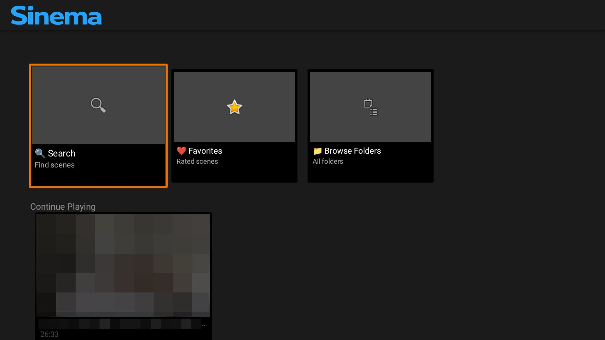
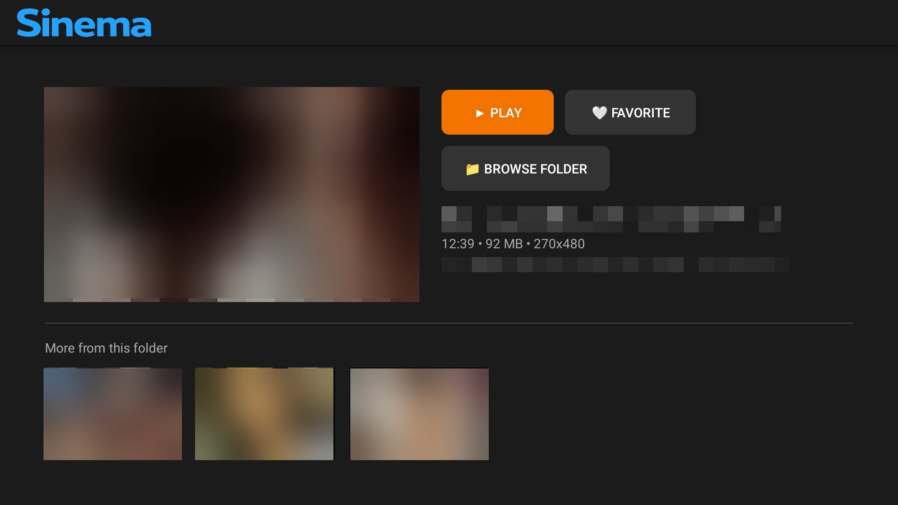
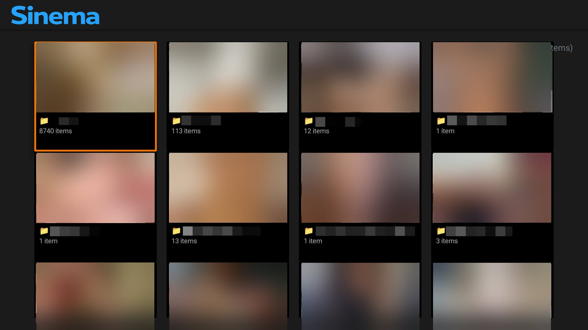
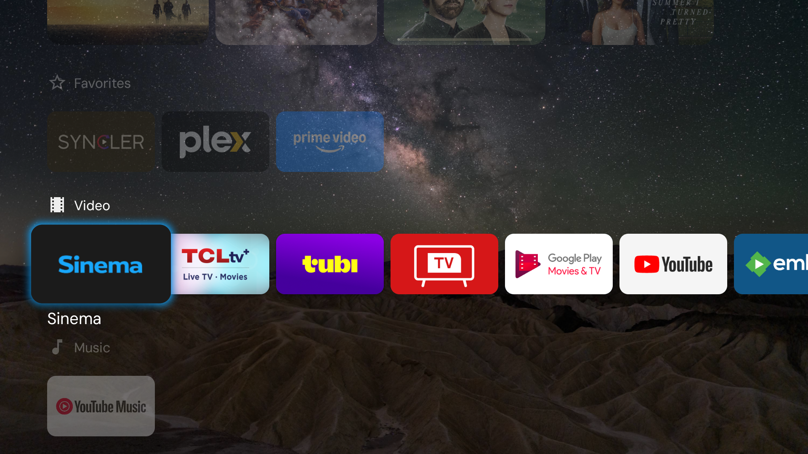

<p align="center">
  
</p>

<p align="center">
  <em>Your private collection deserves a big screen.</em>
</p>

<p align="center">
  Sinema is an Android TV client for <a href="https://github.com/stashapp/stash">Stash</a> — the self-hosted media organizer you already know and love.<br>
  Built for the couch, controlled with a remote, and nobody's business but yours.
</p>

---

## Screenshots

| Home Screen | Scene Details | Browse Folders |
|:---:|:---:|:---:|
|  |  |  |

| Android TV Launcher |
|:---:|
|  |

---

## 🚀 Quick Start

### Prerequisites
- A running [Stash](https://github.com/stashapp/stash) server on your network
- An Android TV device (or any Android device with Leanback support)
- Docker (for building) or Android Studio
- ADB access to your TV

### Build
```bash
# Clone the repo
git clone https://github.com/visorcraft/Sinema.git
cd Sinema

# Build with Docker (no Android Studio needed)
docker build -t sinema-builder -f Dockerfile.build .
docker run --rm -v "$(pwd)":/project -v sinema-gradle-cache:/root/.gradle sinema-builder \
  bash -c "cd /project && ./gradlew assembleRelease --no-daemon"
```

### Install
```bash
# Connect to your TV
adb connect <TV_IP>:5555

# Install (use -r to preserve data on updates)
adb -s <TV_IP>:5555 install -r app/build/outputs/apk/release/app-release.apk

# Launch
adb -s <TV_IP>:5555 shell am start -n com.sinema/.ui.MainActivity
```

### First Launch
1. Open Sinema on your TV
2. You’ll be guided through a setup wizard with **3 options**:
   - **Sign in to Stash** (username/password) — recommended for most users
   - **Web Setup** — enter a short code shown on the TV into a browser to send settings to the device
   - **Manual setup** — enter the server URL + API key directly
3. After setup, Sinema stores settings locally and you can browse immediately.

Notes:
- Stash default port is usually **6969** (e.g. `http://192.168.1.100:6969`).
- If you use the sign-in flow, Sinema will prompt you to choose an auth mode (session cookie vs API key) depending on your Stash configuration.

---

## 🔌 Stash Backend Requirements

Sinema talks to your Stash server via its **GraphQL API**. Here's what you need:

| Requirement | Details |
|---|---|
| **Stash version** | v0.24+ recommended (needs `sceneSaveActivity`, `resume_time` support) |
| **API key** | Generate in Stash → Settings → Security → Authentication |
| **Network** | Sinema and Stash must be on the same network (or accessible via your setup) |
| **Content** | Stash needs scenes with files — Sinema reads what Stash has indexed |

### What Sinema uses from Stash
- **Scenes** — browsing, searching, thumbnails, streaming
- **Folders** — directory-based browsing
- **Ratings** — favorites (rating100 > 0 = ❤️)
- **Playback tracking** — resume position, play count, watch history (all server-side)

---

## ✨ Features

- **🏠 Home Screen** — Continue Playing, Recently Played, Recently Added, Favorites.
- **📁 Folder Browser** — Navigate your library by directory structure.
- **🔍 Search** — Find scenes by filename.
- **▶️ Resume Playback** — Pause anywhere, pick up where you left off (persisted to Stash).
- **❤️ Favorites** — One-tap favorite/unfavorite, synced with Stash ratings. Folders with favorited content show a heart overlay.
- **🎬 Scene Detail** — Thumbnail, metadata, action buttons, related videos from the same folder.
- **🔒 PIN Lock** — Optional 4-digit PIN to keep things private. Log Out locks the app until PIN is re-entered.
- **📺 D-pad Native** — Built for TV remotes, no touchscreen needed.
- **🌙 Dark Theme** — Easy on the eyes for late-night viewing.

---

## 🏗 Tech Stack

- **Kotlin**
- **AndroidX Leanback** (Android TV UI)
- **Media3 (ExoPlayer)** (video playback)
- **Glide** (image loading)
- **OkHttp + Gson** (HTTP + JSON)
- **Stash GraphQL API** (backend)
- **Jetpack Security Crypto** (`EncryptedSharedPreferences` for sensitive storage)

### Build / toolchain versions

| Component | Version |
|---|---:|
| compileSdk / targetSdk | **36** |
| minSdk | **24** |
| Android Gradle Plugin | **8.6.1** |
| Gradle | **8.9** |
| Kotlin | **1.9.24** |
| Java | **17** |

### Key library versions

| Library | Version |
|---|---:|
| Media3 (ExoPlayer) | **1.2.1** |
| Glide | **4.16.0** |
| OkHttp | **4.12.0** |
| Gson | **2.10.1** |
| Coroutines | **1.7.3** |
| Lifecycle Runtime KTX | **2.7.0** |
| Security Crypto | **1.1.0-alpha06** |

---

## 📝 License

Do whatever you want with it. It's your TV. It's your server. It's your business.
