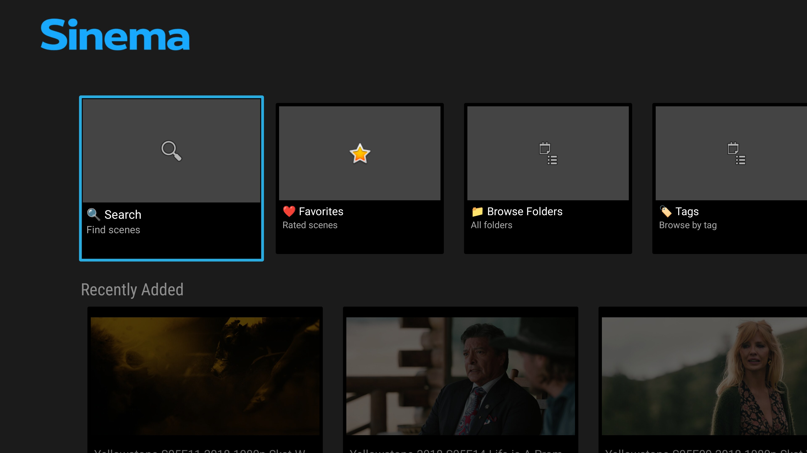
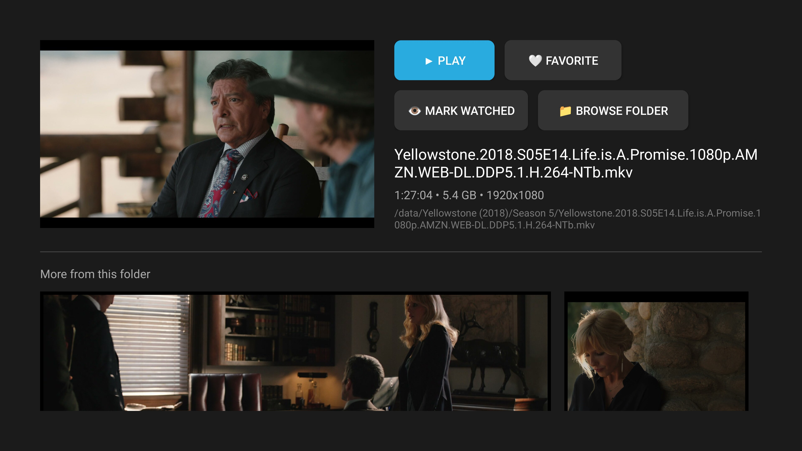
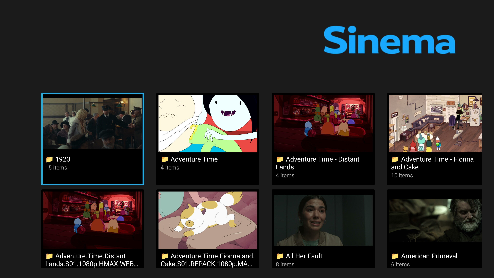
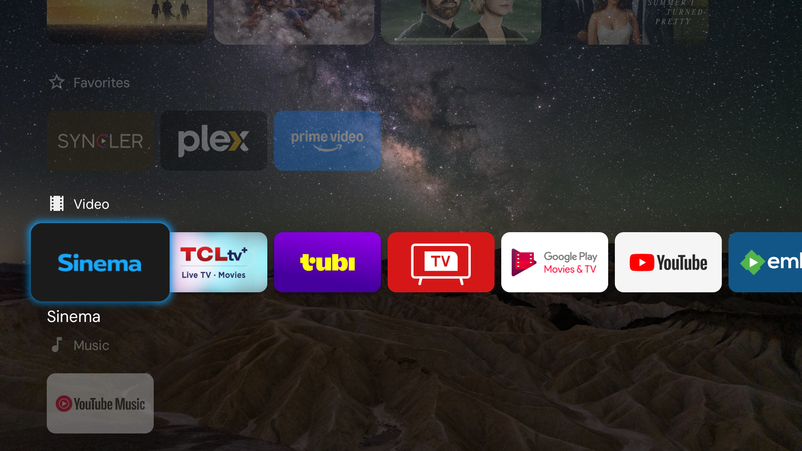

<p align="center">
  
</p>

<p align="center">
  <b>Your private collection deserves a big screen.</b>
  <br />
  An Android TV client for <a href="https://github.com/stashapp/stash">Stash</a> — the self-hosted media organizer you already know and love.
  <br />
  Built for the couch · controlled with a remote · nobody's business but yours.
</p>

<p align="center">
  
  
  
  
  
</p>

---

## Screenshots

| Home Screen | Scene Details | Browse Folders |
|:---:|:---:|:---:|
|  |  |  |

| Android TV Launcher |
|:---:|
|  |

---

## Quick start

### Prerequisites
- A running [Stash](https://github.com/stashapp/stash) server on your network
- An Android TV device (or any Android device with Leanback support)
- Docker (for building) or Android Studio
- ADB access to your TV

### Build
```bash
# Clone the repo
git clone https://github.com/visorcraft/Sinema.git
cd Sinema

# Build with Docker (no Android Studio needed)
docker build -t sinema-builder -f Dockerfile.build .
docker run --rm -v "$(pwd)":/project -v sinema-gradle-cache:/root/.gradle sinema-builder \
  bash -c "cd /project && ./gradlew assembleRelease --no-daemon"
```

### Install
```bash
# Connect to your TV
adb connect <TV_IP>:5555

# Install (use -r to preserve data on updates)
adb -s <TV_IP>:5555 install -r app/build/outputs/apk/release/app-release.apk

# Launch
adb -s <TV_IP>:5555 shell am start -n com.sinema/.ui.MainActivity
```

### First launch
1. Open Sinema on your TV
2. You’ll be guided through a setup wizard with **3 options**:
   - **Sign in to Stash** (username/password) — recommended for most users
   - **Web Setup** — open a temporary browser form from the URL shown on the TV
   - **Manual setup** — enter the server URL + API key directly
3. After setup, Sinema stores settings locally and you can browse immediately.

Notes:
- Stash default port is usually **6969** (e.g. `http://192.168.1.100:6969`).
- If you use the sign-in flow, Sinema will prompt you to choose an auth mode (session cookie vs API key) depending on your Stash configuration.

## Documentation

Full usage documentation lives in [`docs/`](docs/), including setup, browsing, playback, settings, privacy, troubleshooting, and developer reference guides.

Dependency acknowledgements and license details are tracked in [`CREDITS.md`](CREDITS.md) and [`THIRD_PARTY_LICENSES.md`](THIRD_PARTY_LICENSES.md).

---

## Stash backend requirements

Sinema talks to your Stash server via its **GraphQL API**. Here's what you need:

| Requirement | Details |
|---|---|
| **Stash version** | v0.24+ recommended (needs `sceneSaveActivity`, `resume_time` support) |
| **API key** | Generate in Stash → Settings → Security → Authentication |
| **Network** | Sinema and Stash must be on the same network (or accessible via your setup) |
| **Content** | Stash needs scenes with files — Sinema reads what Stash has indexed |

### What Sinema uses from Stash
- **Scenes** — browsing, searching, thumbnails, streaming
- **Folders** — directory-based browsing
- **Tags / Performers / Studios** — metadata browsing and filtering
- **Captions** — subtitle tracks (SRT/VTT)
- **Scene Markers** — chapters for navigation
- **Ratings** — favorites (rating100 > 0 = ❤️)
- **Playback tracking** — resume position, play count, watch history (all server-side)

---

## Features

- **🏠 Home Screen** — Continue Playing, Recently Played, Recently Added, Favorites.
- **🏷️ Metadata Browsing** — Browse by Tags, Performers, and Studios with scene counts and images.
- **📁 Folder Browser** — Navigate your library by directory structure.
- **🔍 Search** — Find scenes by filename with sortable results.
- **▶️ Resume Playback** — Pause anywhere, pick up where you left off (persisted to Stash).
- **🎬 Scene Detail** — Thumbnail, metadata, date, rating, studio, tag/performer chips. Tap chips to browse related scenes.
- **📝 Subtitles & Tracks** — Select subtitle tracks (SRT/VTT), audio tracks, and playback speed.
- **📑 Scene Markers as Chapters** — Jump between markers via chapters dialog or media keys.
- **▶️ Play All & Autoplay** — Queue all scenes in a folder or entity grid; auto-advances when one ends.
- **❤️ Favorites** — One-tap favorite/unfavorite, synced with Stash ratings. Folders with favorited content show a heart overlay.
- **📺 Android TV Channels** — Optional "Watch Next" (Continue Watching) and "Recently Added" rows on the launcher home screen (opt-in, privacy-first).
- **🖥️ Multi-Server Profiles** — Switch between multiple Stash servers from Settings.
- **🔒 PIN Lock** — Optional 4-digit PIN to keep things private. Log Out locks the app until PIN is re-entered.
- **🎮 D-pad Native** — Built for TV remotes, no touchscreen needed.
- **🌙 Dark Theme** — Easy on the eyes for late-night viewing.

---

## Tech stack

- **Kotlin**
- **AndroidX Leanback** (Android TV UI)
- **Media3 (ExoPlayer)** (video playback)
- **Glide** (image loading)
- **OkHttp + Gson** (HTTP + JSON)
- **Stash GraphQL API** (backend)
- **Jetpack Security Crypto** (`EncryptedSharedPreferences` for sensitive storage)
- **AndroidX TVProvider** (Android TV home-screen channels)

### Build / toolchain versions

| Component | Version |
|---|---:|
| compileSdk / targetSdk | **36** |
| minSdk | **24** |
| Android Gradle Plugin | **9.2.1** |
| Gradle | **9.6.1** |
| Kotlin runtime | **2.2.21** |
| Java | **17** |

### Key library versions

| Library | Version |
|---|---:|
| AndroidX Core KTX | **1.18.0** |
| AndroidX Leanback | **1.2.0** |
| Media3 (ExoPlayer) | **1.10.1** |
| Glide | **5.0.7** |
| OkHttp | **5.4.0** |
| Gson | **2.14.0** |
| Coroutines | **1.11.0** |
| Lifecycle Runtime KTX | **2.11.0** |
| Security Crypto | **1.1.0** |
| TVProvider | **1.1.0** |

---

## Contribute

Patches, bug reports, and feedback are welcome. See [`CONTRIBUTING.md`](CONTRIBUTING.md) for the full guide, and [`SECURITY.md`](SECURITY.md) for reporting security issues privately.

- Branch from `main`, send a PR.
- Build with Docker or Android Studio — see [Quick start](#quick-start).

---

## License

Licensed under the **GNU General Public License v3.0** (`GPL-3.0-only`) — see [`LICENSE`](LICENSE) for the full text.

© 2026 VisorCraft LLC. This is free software: you are free to use, study, share, and modify it under the terms of the GPL. It is distributed in the hope that it will be useful, but **WITHOUT ANY WARRANTY**, to the extent permitted by law.

Sinema is an independent client and is not affiliated with or endorsed by the Stash project.
